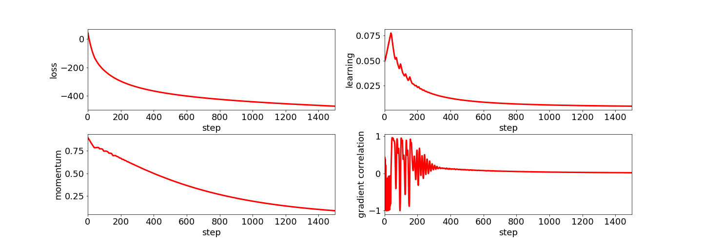

# Notes on the application of the Normalized Gradient Descent approach to Deep Learning

Normalized gradient descent decouples the gradient norm from its direction.
In the simplest setup it just normalizes the gradient and multiply it
by some step.

The simplest optimizer of that form is following:

```python

def l2_normalize(grad: tf.Tensor) -> tf.Tensor:
    return tf.nn.l2_normalize(grad)

class NormalizedSGD(tf.train.Optimizer):
    ...
    def _apply_dense(self, grad: tf.Tensor, var: tf.Variable) -> tf.Operation:
        update_grad = self.lr * tf.nn.l2_normalize(grad)
        return tf.assign_sub(var, update_grad)
```
Despite the simplicity of this approach this methods seems to work
surprisingly well on different benchmarks and in many cases beating
Adam optimizer.

# My notes:

Here are my notes about this problem: [Notes](notes.pdf)

# Related works:

It is worth to check this papers:

* [Block-Normalized Gradient Method: An Empirical Study for Training Deep Neural Network (2018)](https://arxiv.org/abs/1707.04822)
  probably the most related research in that topic. The authors replaced gradients by their norms and plug
  them into existing optimizers like Adam, RMSprop, Momentum. The results indicate the block-normalized gradient can help accelerate the
  training of neural networks.
* [An overview of gradient descent optimisation algorithms](http://ruder.io/optimizing-gradient-descent/) a review on
  existing optimizers.
* [Optimization for Deep Learning Highlights in 2017](http://ruder.io/deep-learning-optimization-2017/) Same source but more recent approaches,
  like new schedulers, optimizers improvements etc.
* [The Power of Normalization: Faster Evasion of Saddle Points](https://arxiv.org/abs/1611.04831)
  normalized gradients and noise injection leads have nice properties to escape from saddle points.
* [New Optimization Methods for Modern Machine Learning (Thesis)](http://www.cs.cmu.edu/~sjakkamr/papers/thesis.pdf)
  contains description on different optimization methods, not necessarily related to this problem,
  but definitely worth to check.
* [Barzilai-Borwein Step Size for Stochastic Gradient Descent](https://arxiv.org/abs/1605.04131) an algorithm for adaptive
  learning rate using Barzilai-Borwein to estimate the step size. I did try the approach of this
  work, however I have found the step estimation with BB to be very unstable. Once the
  estimated step size was of order 100 but in the next epoch it was 0.001. The authors propose
  smoothing method to solve this problem. Maybe I did something wrong when implementing this method.

# Results
## Simple Quadratic problem:

Notebook [Solving_quadratic_equation](notebooks/Solving_quadratic_equation.ipynb)

The aim is to solve quadratic equation of form:

```
L(x) = 0.5 x^T Q x + b^T x
```

where `Q` is random positive-definite matrix, `b` is a random vector.

Notes:

 * adaptive learning rate is working for that case
 * momentum is working too.

### Example result:

* one may note that the initial value of the learning rate was too small
* momentum was decreasing slowly.
* gradient correlation drops to zero. See my notes.



### Comparison with Adam and SGD (momentum=0.9) for different initial values of the learning rate.

When using adaptive method, the initial value of the learning rate should not
be as much important. Check the fig a) where NSGD - denotes the normalized
gradient descent method with adaptive learning rate as discussed in notes.


## Training MLP on MNIST dataset.

Notebook [Training simple multilayer percepton](notebooks/Keras_MLP_test.ipynb)

Model:

    * 30 dense layers of size 128.
    * After each layer Batchnormalization is applied then dropout at level 0.2
    * Small l2 regularization is added to the weights of the network

Notes:
* Adaptive learning rate was not working, as discussed in my notes.
* Momentum was not helping.
* Plain max normalization is used to achieve the best result
  and manual learning rate scheduling.

### Comparision with Adam and SGD with momentum=0.9


## Training CNN on CIFAR10 dataset.

Notebook [Training simple CNN](notebooks/Keras_CNN_CIFAR10_test.ipynb)

The implementation of the CNN net is taken from the: [keras-demo](https://github.com/keras-team/keras/blob/master/examples/cifar10_cnn.py)


Notes:

* Adam, and Normalized gradients train much faster than used in the Keras demo RMSprop
optimizer. The authors report 79% accuracy after 60 epochs. Here we reach 82% in 45 epochs.
* Adaptive learning rate was not working, as discussed in my notes.
* Momentum was not working.
* Plain `std` normalization is used to achieve the best result
  and manual learning rate scheduling. Max normalization was performing a
  worse in that case. Maybe lower learning rate are required to
  get the best result.

### Comparision with Adam and SGD with momentum=0.9


